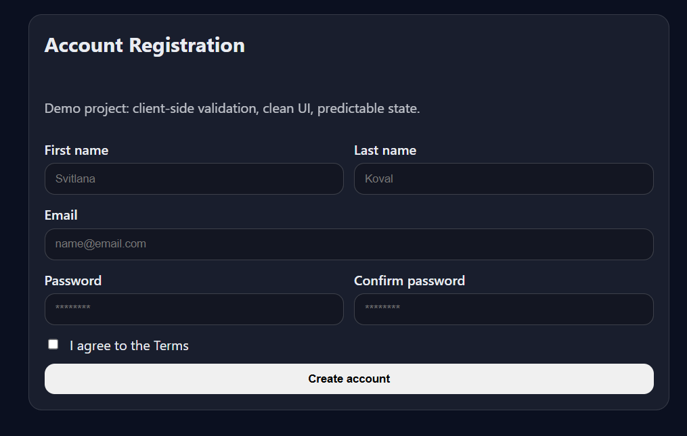
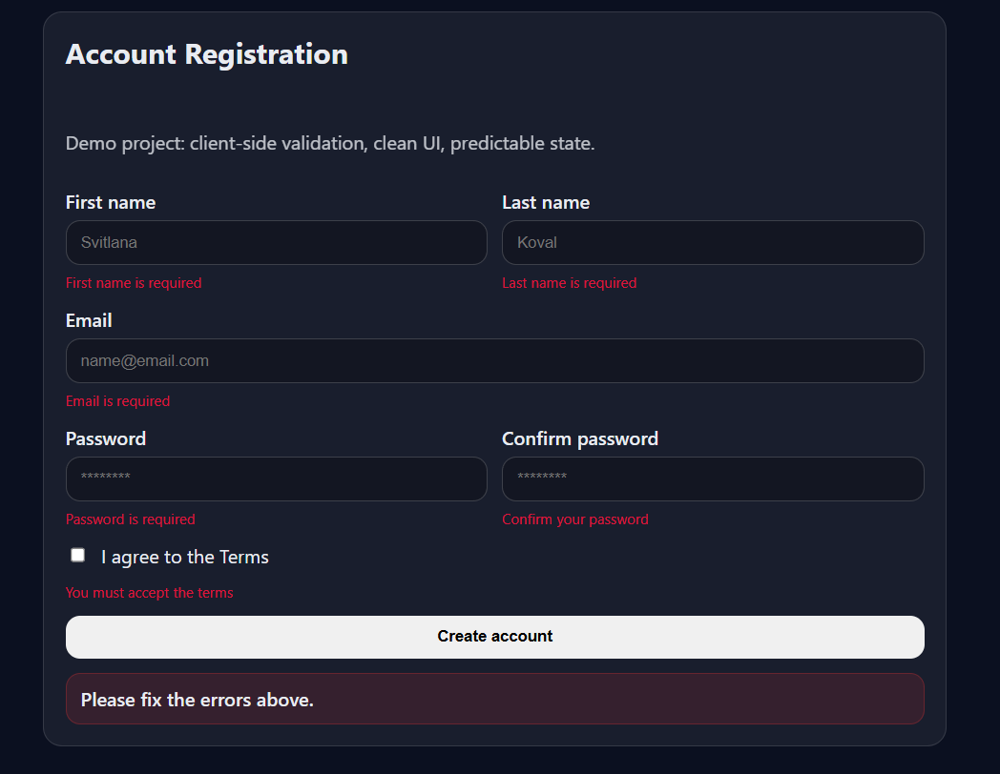
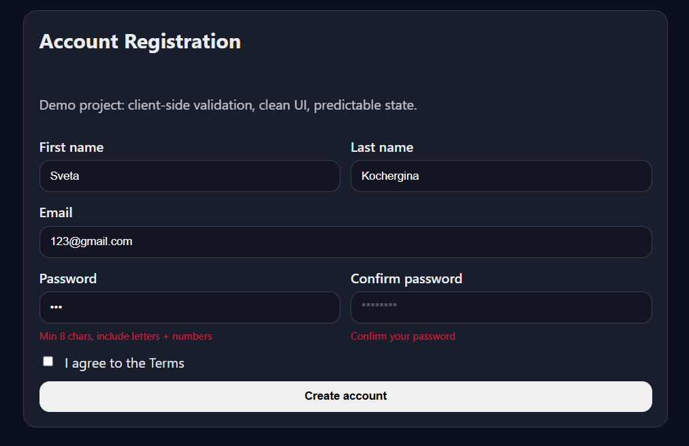
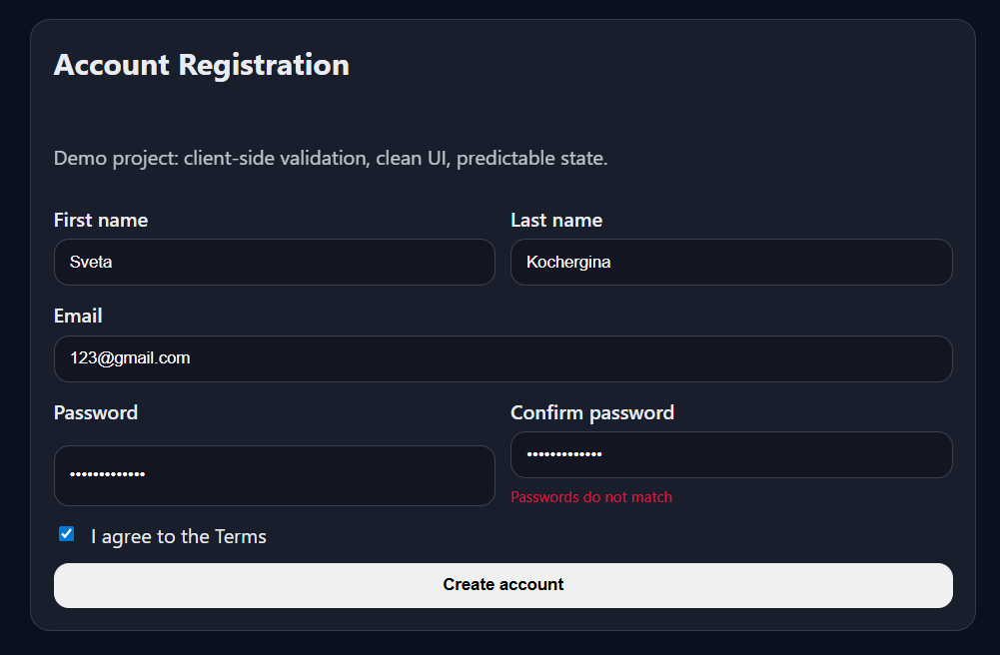
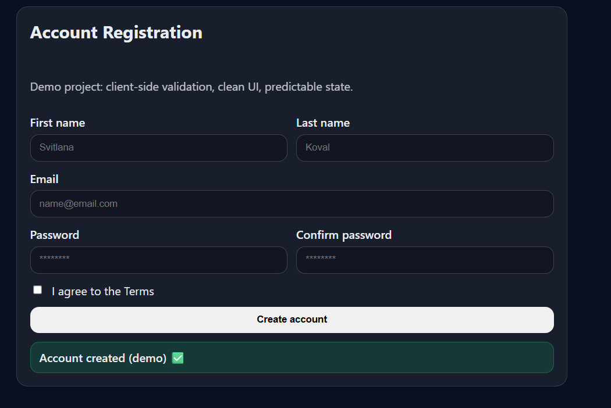

# Account Registration UI (React Form + Validation)

A production-style **account registration flow** demonstrating form architecture, reusable components, and client-side validation logic similar to real SaaS onboarding experiences.
This project focuses on **predictable state management, scalable component design, and strong UX validation patterns.**

## What I Built
- Modular registration form using reusable input components
- Client-side validation (email format, password rules, required fields)
- Password confirmation matching logic
- Terms agreement validation
- Clear error handling and user feedback patterns
- Clean UI structure for scalability and maintainability
- Dark-themed, modern onboarding interface

## Architecture Focus
- **Component-Driven Design**
    - Reusable InputField components
    - Controlled form state
    - Separation between UI and validation logic
    - Scalable structure ready for backend integration
- **Validation Strategy**
    - Field-level validation
    - Real-time feedback on user input
    - Password confirmation matching
    - Prevent submission on invalid state
    - Accessible error messaging patterns
- **UX Considerations**
    - Logical field grouping
    - Password masking
    - Clear call-to-action button
    - Friendly validation messages
    - Predictable state transitions

## Tech Stack
- React
- JavaScript
- Vite
- Component-driven architecture
- Custom validation utilities
- Reusable CSS layout patterns

## Screenshots







## Getting Started
```bash
npm install
npm run dev