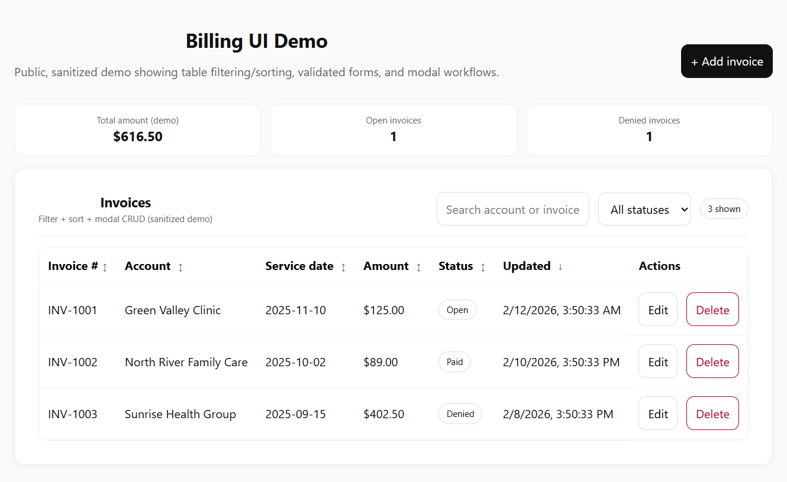

# Billing UI Demo (Sanitized)

A public demo project that showcases **table filtering/sorting**, **forms with validation**, and a **modal workflow** (create/edit/delete confirmation).

This project is intentionally **sanitized**:
- No real patient data
- No employer code
- No proprietary logic

## Features
- **Data table**
  - Search by account name or invoice number
  - Filter by status (Open / Paid / Denied)
  - Sort by columns (invoice #, account, date, amount, status, updated)
- **Validated forms**
  - React Hook Form + Zod
  - Field-level validation + friendly error messages
- **Modal workflow**
  - Add invoice modal
  - Edit invoice modal
  - Delete confirmation modal
- Basic KPI cards (demo totals)

## Tech Stack
- React + TypeScript + Vite
- react-hook-form
- zod
  
## Screenshots



## Getting Started
```bash
npm install
npm run dev
