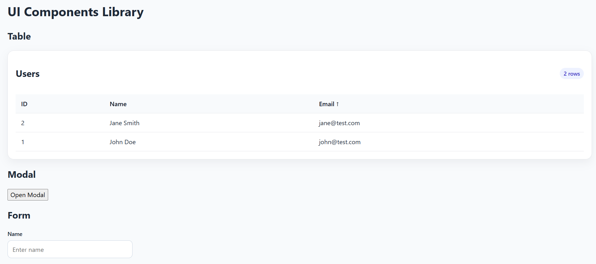
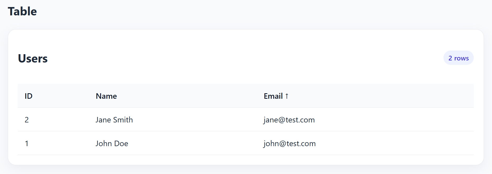
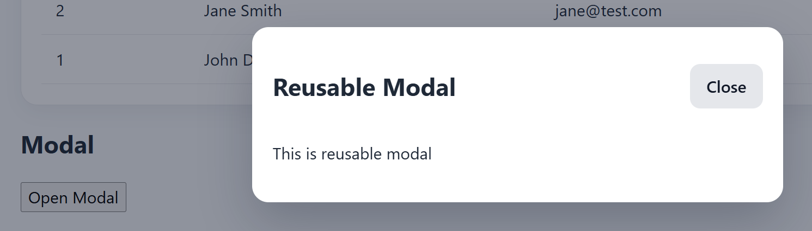
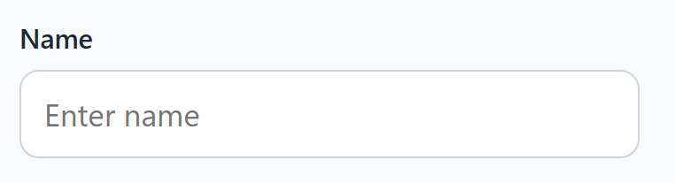

# UI Components & Patterns Library (Practice)

A small front-end practice project built with **React, TypeScript**, and **CSS utility-style patterns** to demonstrate reusable UI building blocks and clean component design.

This project is part of my portfolio and focuses on creating practical patterns that appear in real business applications: **tables, modals, forms, validation helpers, loading states, and error handling.**

## Tech Stack
- React
- TypeScript
- Vite
- CSS / Tailwind-like utility patterns

## Features
- Reusable data table component
  - sortable columns
  - empty state
  - loading state
  - error state
- Reusable modal component
  - overlay
  - close button
  - ESC key handling
  - action footer
- Reusable form patterns
  - labeled fields
  - required field handling
  - inline validation messages
  - disabled submit states
- Validation helpers
  - simple reusable validators
  - error message mapping
- Shared UI states
  - skeleton / loading feedback
  - empty data state
  - recoverable error message blocks

## Why I built this

In my current software engineering work, I often build and improve business-facing UI flows with forms, tables, and modal-driven workflows. I created this practice project to showcase the kinds of reusable front-end patterns that help teams move faster while keeping the UI consistent and maintainable.

## Project Goals

- Practice reusable component design
- Keep components small and composable
- Separate UI, state, and validation logic clearly
- Build portfolio-ready examples that mirror real production patterns

## Screenshots





## Getting Started
```bash
npm install
npm run dev

